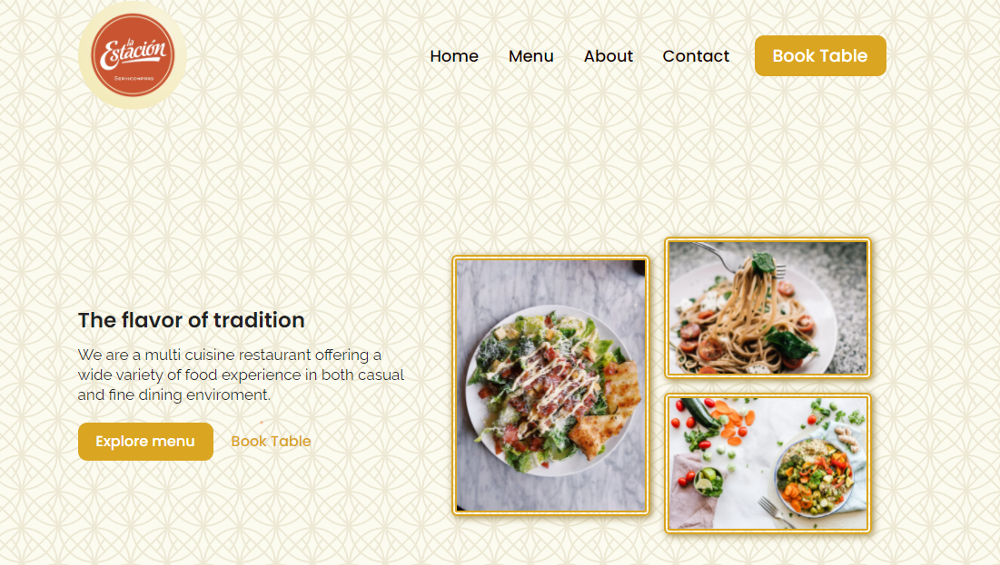

# La Estacion Website
Esta es una pagina creada para un patio de comidas que se encuentra en la zona, donde cuenta con el menu de manera digital, y ademas una zona para realizar reservas completamente funcional.

# Tecnologias utilizadas
      

Ademas se utiliza la libreria de Javascripts <a href="https://michalsnik.github.io/aos/">Aos Animation</a> y se complementa con el uso de <a href="https://formspree.io">Formspree</a> que es un una API para el manejo de formularios.

# Contactame
 Puedes contactarme a través de mi <a href="http://https://www.linkedin.com/in/mauro-ibarra-665323203/">Linkedin</a>
Dejo a disposición mi <a href="https://twitter.com/mauritoibarra29">Twitter</a> e <a href="https://www.instagram.com/mauritoibarra/?hl=es-la">Instagram</a>
